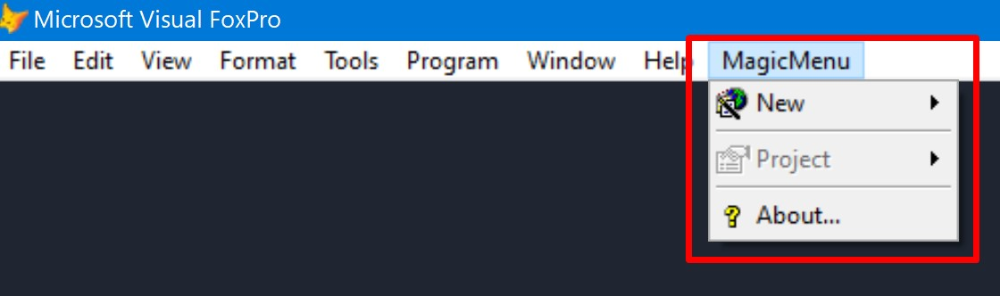
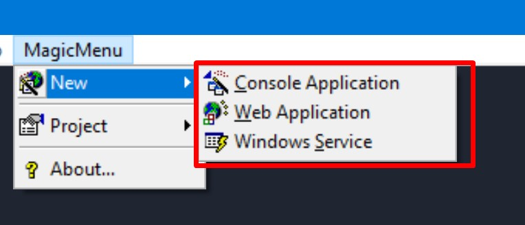
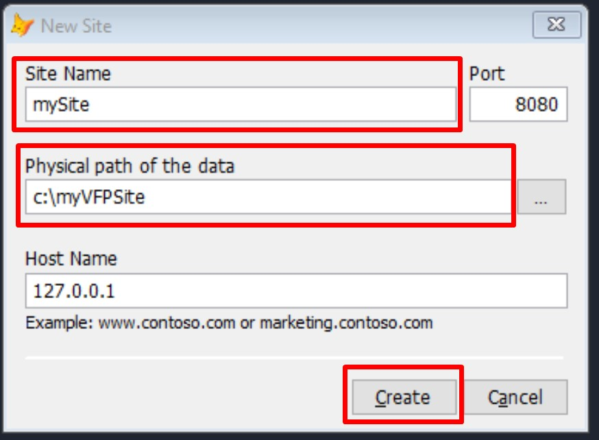
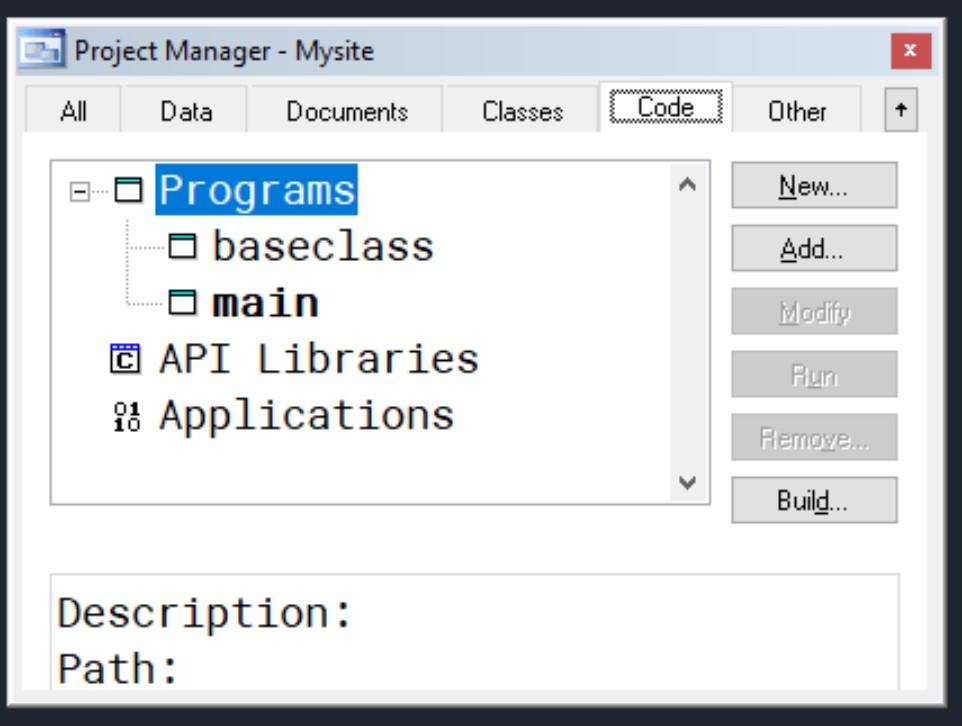
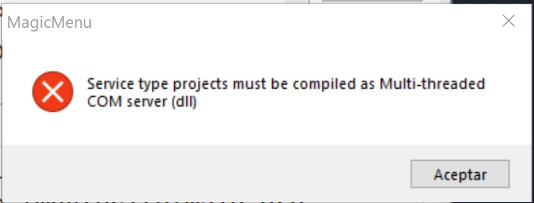
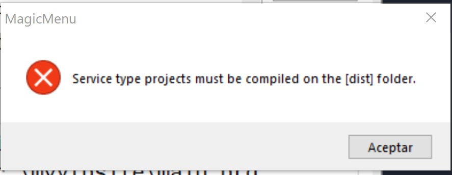
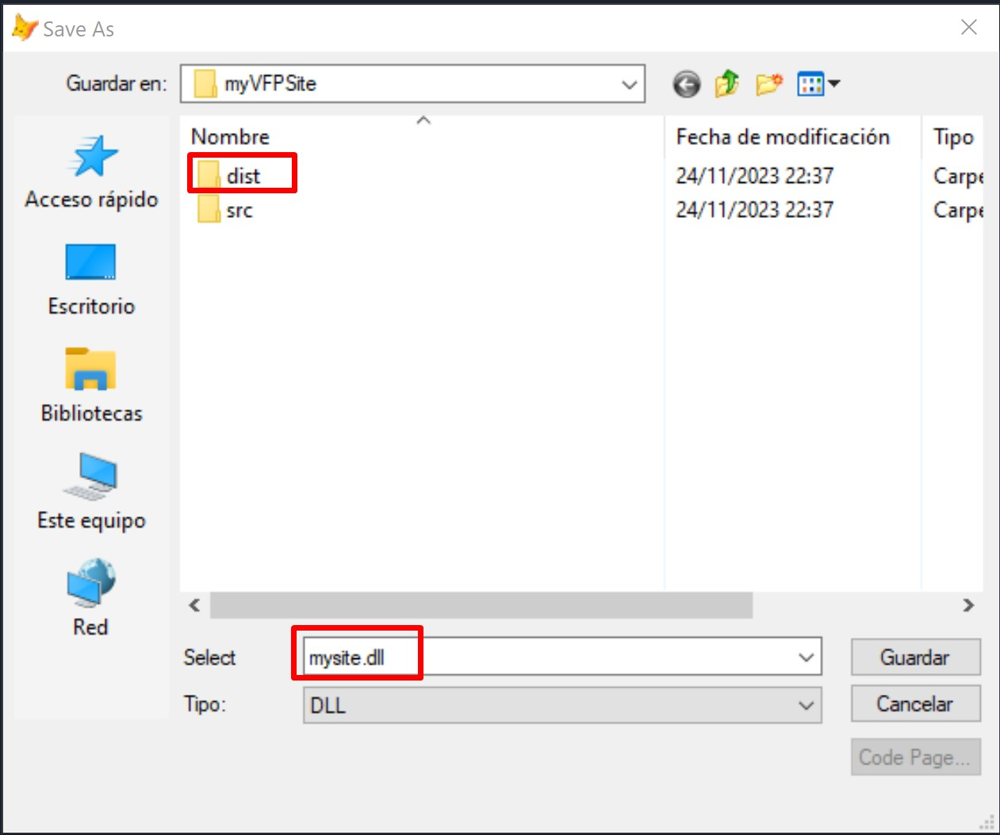
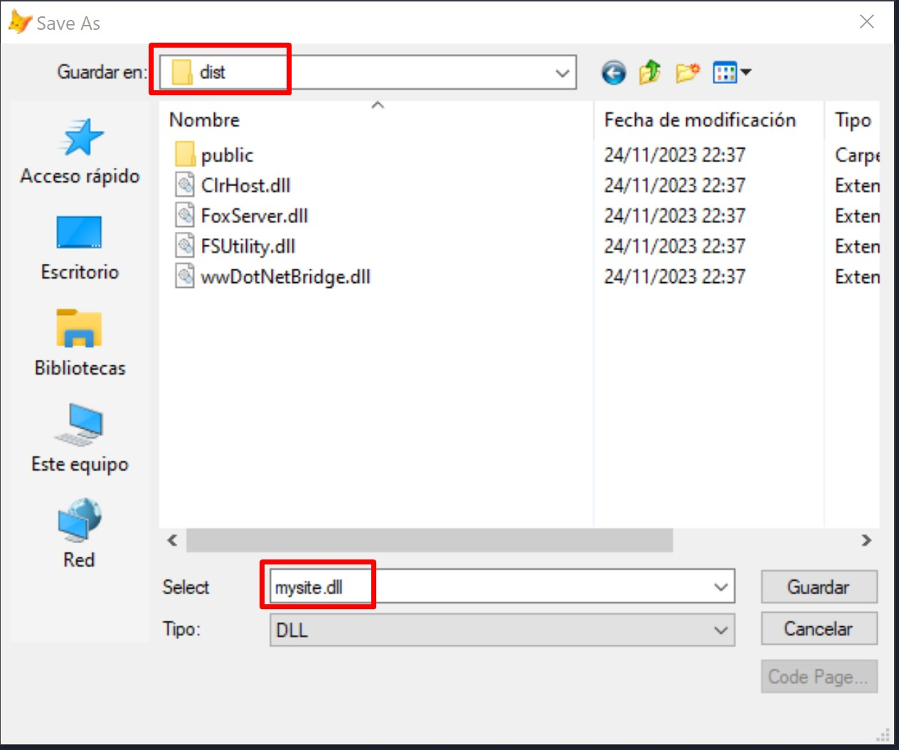
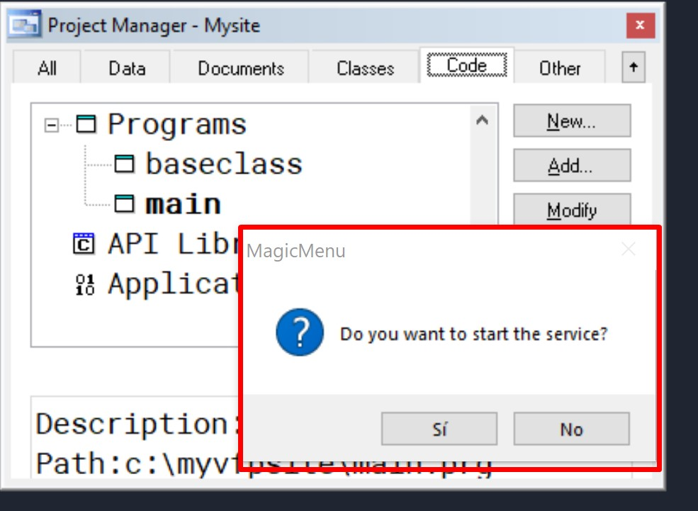
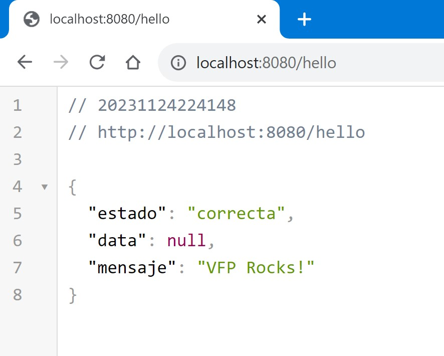

# MagicMenu - 为您的 Visual FoxPro 项目提供新的功能支持

MagicMenu 是一个旨在增强和扩展 Visual FoxPro 9.0 的工具。您可以使用它来创建之前在 VFP 中难以完成的项目，例如 WEB 项目、Windows 服务和控制台应用。

## 关键特性

- **使用 [FoxServer](https://github.com/VFPLegacy/FoxServer) 创建 WEB 项目:** MagicMenu 允许您使用 FoxServer 库创建 web _(API REST, HTML based)_ 应用，该库允许您在 VFP 中编写后端的逻辑代码。
- **Windows 服务:** 轻松创建用于自动后台运行的 Windows 服务。
- **控制台应用:** 通过命令行交互执行特定任务的控制台应用。
- **本地接口:** MagicMenu 在本地 Fox 菜单中运行，并使用本地项目管理器和名为 MagicMenuProjectHook 的 Hook 类来扩展其功能。

## MagicMenu 入门

1. **下载和安装:**
   - 下载 [MagicMenu](https://github.com/VFPLegacy/MagicMenu/releases/download/v1.0.1/MagicMenu-v101.app.zip) 。
   - 解压后将 .app 文件拷贝至你的 **Visual FoxPro 安装目录** (特别提醒：如果你身处中国，或者像中国一样受严格的网络管制而无法直接访问 github 的国家和地区，请将 domain4cn.txt 文件一起拷贝，这样，你可以在文件中镜像地址失效时很容易的进行更换)。
   - 以管理员身份运行 VFP，并在命令窗口执行：
```xBase
DO MagicMenu WITH "CN"
```

### 菜单选项


### 新建 子菜单选项


### 项目 子菜单选项


## 创建 Web 应用
- 转到 MagicMenu->新建->Web 应用


- 填写 **站点名称, 数据物理路径和 Host 名称** 并单击**创建**按钮。


MagicMenu 将根据 [FoxServer](https://github.com/VFPLegacy/FoxServer/blob/main/setup.manifest) 的清单文件下载运行时、创建项目文件夹和模板，并在完成后打开新创建的项目。



- 编译项目为一个多线程 COM 服务 (dll)
如果您选择了其他的编译选项，您会看到如下消息：


如果您选择了一个不同于 *'dist/'* 的路径，您会看到如下消息：


您必须选择 *'dist'* 目录，并且不能更改建议的编译名称。




编译完成后，它将询问您是否启动服务：



**使用 项目 子菜单来启动/停止服务**

- 打开浏览器并导航至: *http://localhost:8080/hello*



## 贡献和支持

如果您想为 MagicMenu 的开发做出贡献，请访问我们的 GitHub 存储库并按照说明提交拉取请求。

中国境内: 


中国境外: 
您还可以通过成为 Patreon 的赞助人来支持我们，以帮助维护和增强此工具。

## 捐赠和赞助

如果您发现 MagicMenu 对您的工作有用并希望支持其开发和维护，请考虑通过 [PayPal](https://www.paypal.com/donate/?hosted_button_id=LXQYXFP77AD2G) 捐款或者通过 [Patreon](https://www.patreon.com/IrwinRodriguez) 成为赞助人。

感谢您选择 MagicMenu 用以提升您在 Visual FoxPro 中的项目！

## 中国境内捐助名单（按时间顺序）
1.孙明杰
2.黄志春
3.陈金虎
4.王建志
5.汪洋
6.明镜
7.东升
8.青柠
9.谢佳缘
10.韦龙
11.JaimeCao
12.吴泉伍
13.张桂州

**谨代表作者向诸位致以最诚挚的感谢！**

**承诺：所有中国境内通过微信捐助的金额，将会全额转给作者**

(名单及时更新中......)

## 鸣谢
[wwDotNetBridge](https://github.com/RickStrahl/wwDotnetBridge)

**免责声明**

本软件按“原样”提供，不作任何明示或暗示的保证，包括但不限于适销性、特定用途适用性和不侵权的保证。在任何情况下，作者或版权所有者均不对因本软件或本软件的使用或其他交易而引起或与之相关的任何索赔、损害或其他责任负责，无论是在合同诉讼、侵权行为还是其他诉讼中。
