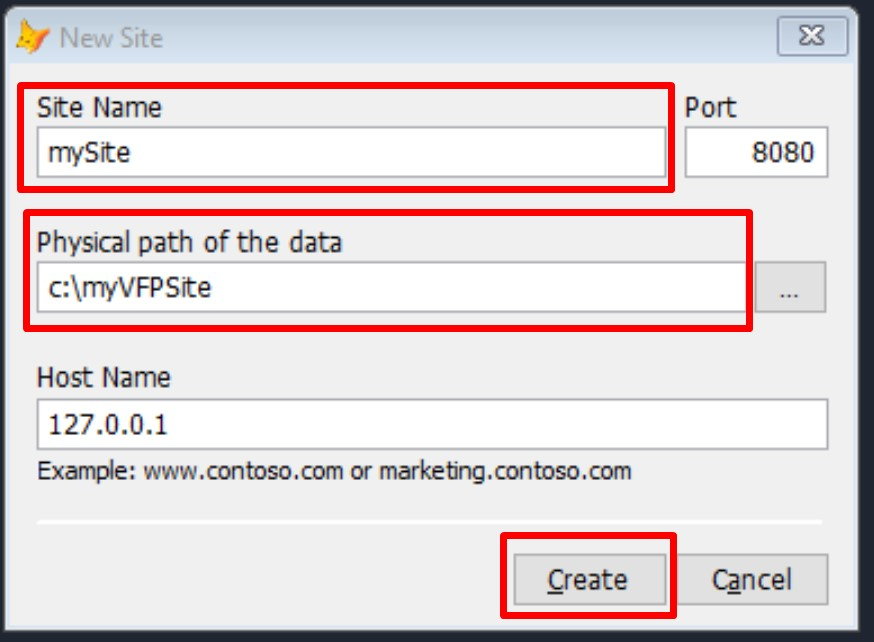
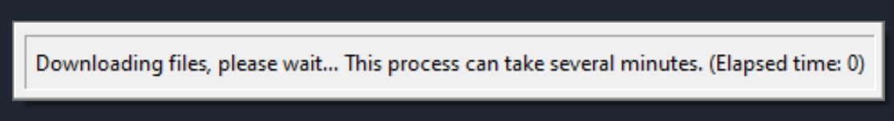
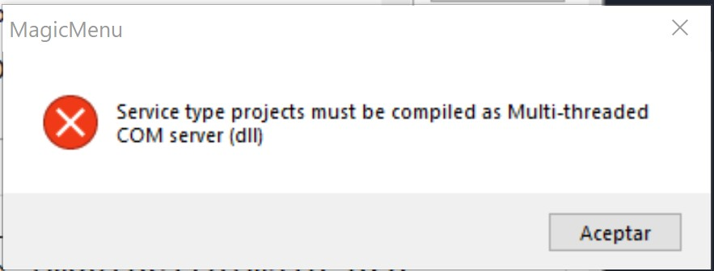
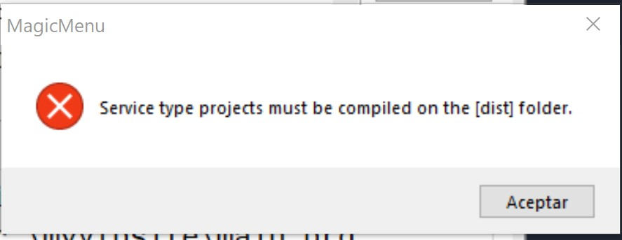
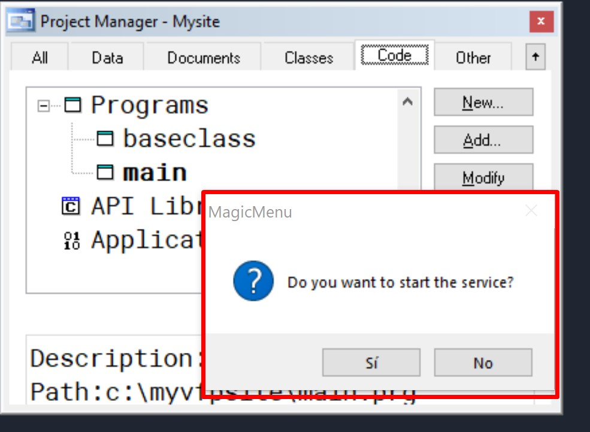
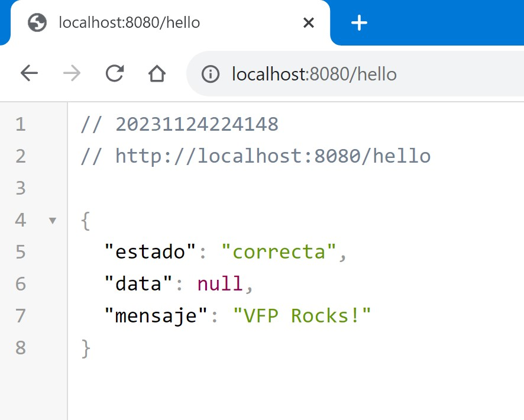

# MagicMenu - Empowering Your Visual FoxPro Projects

MagicMenu is a tool designed to enhance and extend the capabilities of Visual FoxPro 9.0. With MagicMenu, you can create projects that were previously challenging to accomplish in VFP, such as Web Projects, Windows Services, and Console Applications.

## Key Features

- **Create Web Projects with [FoxServer](https://github.com/VFPLegacy/FoxServer):** MagicMenu allows you to create web _(API REST, HTML based)_ applications by using the FoxServer libraries that let you write your backend logic code in VFP.
- **Windows Services:** Effortlessly create Windows services for background tasks and process automation.
- **Console Applications:** Develop console applications for executing specific tasks via command-line interactions.
- **Native Interface:** MagicMenu runs in a native Fox menu and uses the native Project Manager with a Hook class called **MagicMenuProjectHook** that extends it's capabilities.

## Getting Started with MagicMenu

1. **Download and Installation:**
   - Download [MagicMenu](https://github.com/VFPLegacy/MagicMenu/releases/download/v1.0.1/MagicMenu-v101.app.zip) application.
   - Copy the .app file into your **Visual FoxPro home directory.**
   - Open the VFP IDE (as Administrator) and hit the following command:
```xBase
DO MagicMenu WITH "EN"
```

### Native menu options


### New submenu options


### Project submenu options


## Creating a Web Application
- Go to MagicMenu->New->Web Application


- Fill **Site Name, Physical path of the data and Host Name** and hit the **Create** button.


MagicMenu will download the runtimes from the [FoxServer](https://github.com/VFPLegacy/FoxServer/blob/main/setup.manifest) manifest file and create the main project folder and templates. When finish it will open the newly created project.



- Compile the Project as Multi-threaded COM server (dll)
if you clic another compiling option then you will get this message


And if you select a another folder from *'dist/'* then you will get this message


You have to select the *'dist'* and dont change the suggested compiled name.


When compilation finishes it will ask you if you want to start the service:



**USE THE PROJECT MENU IN ORDER TO START/STOP YOUR SERVICE**

- Open your browser and navegate to: *http://localhost:8080/hello*



## Contributions and Support

If you'd like to contribute to the development of MagicMenu, visit our GitHub repository and follow the instructions to submit a pull request. You can also support us by becoming a patron on Patreon to help maintain and enhance this tool.

## Donations and Patronage

If you find MagicMenu useful for your work and wish to support its development and maintenance, consider making a donation via [PayPal](https://www.paypal.com/donate/?hosted_button_id=LXQYXFP77AD2G) or becoming a patron on [Patreon](https://www.patreon.com/IrwinRodriguez).

Thank you for choosing MagicMenu to elevate your projects in Visual FoxPro!

## Credits
[wwDotNetBridge](https://github.com/RickStrahl/wwDotnetBridge)

**NO WARRANTY**
THE SOFTWARE IS PROVIDED "AS IS", WITHOUT WARRANTY OF ANY KIND, EXPRESS OR IMPLIED, INCLUDING BUT NOT LIMITED TO THE WARRANTIES OF MERCHANTABILITY, FITNESS FOR A PARTICULAR PURPOSE AND NONINFRINGEMENT. IN NO EVENT SHALL THE AUTHORS OR COPYRIGHT HOLDERS BE LIABLE FOR ANY CLAIM, DAMAGES OR OTHER LIABILITY, WHETHER IN AN ACTION OF CONTRACT, TORT OR OTHERWISE, ARISING FROM, OUT OF OR IN CONNECTION WITH THE SOFTWARE OR THE USE OR OTHER DEALINGS IN THE SOFTWARE.
